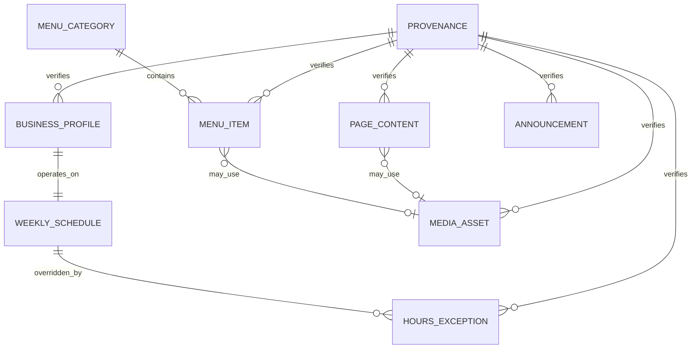

# Phase 1 Data Model: Grande Burrito Restaurant Website

## Modeling rules

- Sanity is the only authoring source for operational and marketing content.
- Public queries return a normalized projection rather than raw Studio documents.
- Every public entity has a stable `_id`, revision metadata, and a publication state.
- Required facts cannot be published while marked provisional.
- Editor fields describe content intent, not layout or visual styling.
- Referential integrity is validated before snapshot generation and production builds.

## Business Profile

Singleton containing facts shared across the entire experience.

| Field | Type | Rules |
|---|---|---|
| `name` | string | Required; canonical public name; confirmed before production |
| `legalName` | string | Optional; never substituted for public name automatically |
| `tagline` | string | Optional; plain text; concise |
| `phone` | string | Required; normalized E.164 value plus formatted display value |
| `address` | object | Required street, locality, region, postal code, country |
| `coordinates` | geopoint | Required for directions link and structured data |
| `timezone` | enum | Fixed to `America/New_York` for this location |
| `orderingUrl` | URL | Optional; HTTPS and approved domain only |
| `directionsUrl` | URL | Required; generated from confirmed coordinates or address |
| `socialLinks` | array | Optional allowlisted providers and HTTPS URLs |
| `priceRange` | enum | Optional structured-data value after confirmation |
| `provenance` | provenance | Required |
| `lastReviewedAt` | datetime | Required before production |

## Weekly Schedule

Singleton with seven day records. A day has zero or more local-time intervals.

| Field | Type | Rules |
|---|---|---|
| `day` | enum | Unique Monday through Sunday |
| `intervals` | array | Ordered, non-overlapping `opensAt`/`closesAt` local times |
| `isClosed` | boolean | Derived from an empty interval list, not separately authored |

An interval may cross midnight only when `closesAt` is earlier than `opensAt`. A
cross-midnight interval belongs to the day on which it opens. Intervals cannot overlap
after expansion into a 48-hour comparison window.

## Hours Exception

One document per exceptional local date or inclusive date range.

| Field | Type | Rules |
|---|---|---|
| `startsOn` | local date | Required |
| `endsOn` | local date | Required; equal to or later than `startsOn` |
| `status` | enum | `closed` or `special-hours` |
| `intervals` | array | Required only for `special-hours`; same rules as weekly intervals |
| `publicNote` | string | Optional; concise and factual |
| `internalNote` | string | Optional; excluded from public query |
| `priority` | integer | Required constrained value for intentional overlap resolution |
| `expiresAt` | datetime | Derived operational cleanup value |
| `provenance` | provenance | Required |

An exception replaces the weekly schedule for each covered local date. When multiple
exceptions cover a date, the shortest covered range wins, followed by highest priority.
Equal-span/equal-priority overlaps are ambiguous and blocked by Studio and production
validation. Past exceptions remain in history but are hidden from Today after expiry.

## Menu Category

| Field | Type | Rules |
|---|---|---|
| `name` | string | Required and unique within active categories |
| `slug` | slug | Required, stable after publish |
| `description` | string | Optional |
| `sortOrder` | integer | Required; Studio provides ordered-list controls |
| `isActive` | boolean | Required; inactive categories are excluded publicly |

## Menu Item

| Field | Type | Rules |
|---|---|---|
| `name` | string | Required |
| `description` | text | Optional; plain text; no embedded layout |
| `category` | reference | Required active Menu Category |
| `priceOptions` | array | One or more label/amount pairs; amount normalized to integer minor units |
| `marketPriceLabel` | string | Optional, mutually exclusive with `priceOptions` |
| `dietaryLabels` | enum array | Optional; only verified labels may be selected |
| `heatLevel` | enum | Optional: `mild`, `medium`, `hot` |
| `availability` | enum | Required: `available` or `sold-out` |
| `isVisible` | boolean | Required; false excludes the item publicly without deletion |
| `isFeatured` | boolean | Optional; maximum configured count enforced |
| `seasonality` | object | Optional start/end local dates and verified public label |
| `image` | media reference | Optional; asset must be licensed or owned |
| `sortOrder` | integer | Required within category |
| `provenance` | provenance | Required |

Each price option has a required display label when there is more than one option.
Prices are stored in integer minor units in the normalized contract to avoid floating
point ambiguity. Dietary labels cannot be inferred from descriptions or ingredients.

## Announcement

| Field | Type | Rules |
|---|---|---|
| `title` | string | Required |
| `message` | text | Required; plain text |
| `kind` | enum | `info`, `service-change`, `closure`, `promotion` |
| `startsAt` | datetime | Required |
| `endsAt` | datetime | Optional; when present, later than start |
| `action` | object | Optional label and safe URL |
| `priority` | integer | Constrained range; resolves overlapping announcements |
| `isEnabled` | boolean | Required |
| `provenance` | provenance | Required |

The public query returns enabled announcements whose interval contains the current
instant, ordered by priority then start time. Scheduling changes visibility, not the
underlying publication state.

## Page Content

Singleton for bounded marketing copy.

| Field | Type | Rules |
|---|---|---|
| `heroEyebrow` | string | Optional |
| `heroHeading` | string | Required |
| `heroBody` | text | Required; short plain text |
| `storyHeading` | string | Optional |
| `storyBody` | portable text | Restricted to paragraphs, emphasis, links, and lists |
| `menuHeading` | string | Required |
| `locationHeading` | string | Required |
| `seoTitle` | string | Required; length guidance and preview |
| `seoDescription` | string | Required; length guidance and preview |
| `socialImage` | media reference | Optional; approved provenance required |
| `provenance` | provenance | Required |

No field exposes color, font, spacing, width, alignment, arbitrary class names, or raw
HTML.

## Media Asset Metadata

Sanity image assets referenced by public documents carry required editorial metadata.

| Field | Type | Rules |
|---|---|---|
| `alt` | string | Required when image conveys content; empty only when explicitly decorative |
| `caption` | string | Optional |
| `credit` | string | Optional display credit |
| `rightsStatus` | enum | `provisional`, `owned`, `licensed`, `permission-granted` |
| `rightsEvidence` | string or URL | Required unless `provisional`; Studio-only |
| `focalPoint` | hotspot | Required for prominent crops |
| `provenance` | provenance | Required |

Only assets with a production-safe `rightsStatus` can enter the production snapshot.

## Provenance

Reusable object attached to public-facing facts and assets.

| Field | Type | Rules |
|---|---|---|
| `status` | enum | `placeholder`, `provisional`, `confirmed`, `licensed` |
| `source` | string | Required; e.g. owner confirmation, printed menu, supplied asset |
| `verifiedAt` | datetime | Required for confirmed/licensed values |
| `verifiedBy` | string | Required for confirmed/licensed values |
| `notes` | string | Optional; Studio-only |

Production validation rejects placeholder or provisional profile facts, hours, prices,
dietary claims, marketing claims, and media. Draft preview may show unresolved content
with an editor warning that is never part of the public design.

## Normalized Public Site Snapshot

The frontend consumes one versioned projection:

| Field | Type | Source |
|---|---|---|
| `schemaVersion` | integer | Snapshot generator |
| `generatedAt` | datetime | Snapshot generator |
| `contentRevision` | string | Hash/revision of source query result |
| `business` | object | Business Profile |
| `weeklySchedule` | array | Weekly Schedule |
| `hoursExceptions` | array | Current and near-future exceptions |
| `menu` | category array with items | Active categories and available items |
| `announcements` | array | Published schedule-capable announcements |
| `page` | object | Page Content |
| `media` | normalized references | Approved Sanity image metadata |

Runtime fetching and build-time snapshot generation use the same query and normalizer.
The public app is indifferent to whether the normalized value came from Sanity or the
snapshot.

## Relationships

## State transitions

### Content lifecycle

`draft provisional` → `draft confirmed/licensed` → `published` → `superseded or unpublished`

- Draft preview accepts provisional content and labels it for editors.
- Production publication is blocked when a required public fact is provisional.
- Unpublishing an essential singleton is blocked or requires an immediate valid
  replacement.

### Menu availability

`available` ↔ `sold-out`; `visible` ↔ `hidden`

Sold-out items may remain visible with an explicit state. Hidden items remain editable
and retain ordering but are excluded from the public projection. Neither change deletes
or unpublishes the document.

### Announcement visibility

`draft` → `published, scheduled` → `visible` → `expired or manually disabled`

Visibility is derived from publication, enabled state, and the Eastern Time-aware
schedule. An announcement without an end remains visible until disabled or unpublished;
expiry does not delete history.

### Runtime content source

`fresh CDN content` → `cached stale-while-revalidate content` → `deployment snapshot`

The app records which source supplied a request. Falling back does not mutate content;
recovery occurs automatically when a later request succeeds.
