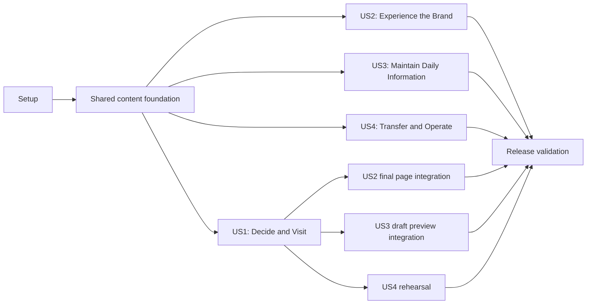

# Tasks: Grande Burrito Restaurant Website

**Input**: Design documents from `/specs/001-restaurant-site/`

**Prerequisites**: `plan.md`, `spec.md`, `research.md`, `data-model.md`, `contracts/`, `quickstart.md`

**Tests**: Tests are included because the specification has explicit journey,
accessibility, content-integrity, outage, and performance success criteria. Within each
story, create the named failing test or acceptance fixture before its implementation.

**Organization**: Tasks are grouped by user story so each increment can be demonstrated
and validated independently after the shared content foundation exists.

## Format: `[ID] [P?] [Story] Description`

- **[P]**: Can run in parallel after the phase prerequisites because it changes distinct files
- **[Story]**: Maps implementation and verification to a specification user story
- Every task names the exact file or directory it owns

## Phase 1: Setup (Shared Infrastructure)

**Purpose**: Establish the two deployable applications, one typed shared boundary, and
repeatable project tooling.

- [x] T001 Create the pnpm workspace, Node 22 pin, and root scripts in `pnpm-workspace.yaml`, `package.json`, and `.nvmrc`
- [x] T002 Create the SvelteKit TypeScript application with Vercel adapter in `apps/web/`
- [x] T003 [P] Create the Sanity Studio application and development dataset configuration in `apps/studio/`
- [x] T004 [P] Create the shared TypeScript content package with build exports in `packages/content/`
- [x] T005 [P] Configure formatting, linting, TypeScript, Svelte checks, Vitest, and Playwright in `eslint.config.js`, `prettier.config.js`, `tsconfig.json`, and `apps/web/playwright.config.ts`
- [x] T006 Document public versus server-only configuration and add validated loaders in `.env.example`, `apps/web/src/lib/server/env.ts`, and `apps/studio/sanity.cli.ts`
- [x] T007 Add CI install, check, unit-test, snapshot-validation, build, and browser-test jobs in `.github/workflows/ci.yml`

**Checkpoint**: Both apps start locally, shared code imports successfully, secrets remain
ignored, and CI can execute placeholder validation commands.

---

## Phase 2: Foundational (Blocking Prerequisites)

**Purpose**: Implement the single content boundary, resilient delivery path, and
representative data required by every story.

**⚠️ CRITICAL**: No user-story UI or Studio workflow begins until this phase passes.

- [ ] T008 Define versioned normalized public-content, money, media, provenance, and schedule types in `packages/content/src/types.ts`
- [ ] T009 [P] Create clearly fictional development fixtures covering long copy, missing media, schedule edges, and menu states in `packages/content/test/fixtures/development-content.ts`
- [ ] T010 [P] Write failing normalization and production-provenance tests in `packages/content/tests/normalize.test.ts`
- [ ] T011 Implement deterministic validation, normalization, ordering, URL safety, and price conversion in `packages/content/src/normalize.ts`
- [ ] T012 Define the single published/draft GROQ projection and query parameters in `packages/content/src/queries.ts`
- [ ] T013 [P] Write failing snapshot generation and invalid-fallback tests in `packages/content/tests/snapshot.test.ts`
- [ ] T014 Implement published snapshot generation with schema/revision metadata and provisional-content rejection in `packages/content/src/snapshot.ts` and `scripts/generate-content-snapshot.ts`
- [ ] T015 [P] Write failing timeout, malformed-live-response, and full-snapshot-fallback tests in `apps/web/src/lib/server/content.test.ts`
- [ ] T016 Implement bounded Sanity fetching, validation, cache policy, diagnostics, and whole-snapshot fallback in `apps/web/src/lib/server/content.ts`
- [ ] T017 Wire root error handling, security headers, preview isolation, and server logging in `apps/web/src/hooks.server.ts` and `apps/web/src/routes/+error.svelte`

**Checkpoint**: The same typed projection powers live, preview, fixture, and snapshot
sources; malformed or unavailable live content produces a complete valid fallback.

---

## Phase 3: User Story 1 — Decide and Visit (Priority: P1) 🎯 MVP

**Goal**: A mobile visitor can determine current status, scan the current menu, and call
or get directions immediately, including with JavaScript disabled or Sanity unavailable.

**Independent Test**: At 390×844, use only the public page to identify open state and a
menu item, then activate call or directions; repeat with JavaScript disabled and with
Sanity forced to time out.

### Tests for User Story 1

- [ ] T018 [P] [US1] Write failing interval, split-day, overnight, exception, and daylight-saving tests in `apps/web/src/lib/hours/resolve.test.ts`
- [ ] T019 [P] [US1] Write failing mobile, no-JavaScript, and CMS-outage journey tests in `apps/web/tests/e2e/decide-and-visit.spec.ts`
- [ ] T020 [P] [US1] Write failing page metadata and Restaurant JSON-LD consistency tests in `apps/web/src/routes/page.server.test.ts`
- [ ] T021 [P] [US1] Write a failing in-session announcement and hours-expiry test using a controlled clock in `apps/web/tests/e2e/scheduled-content.spec.ts`

### Implementation for User Story 1

- [ ] T022 [US1] Implement Eastern Time schedule resolution and next-transition calculation in `apps/web/src/lib/hours/resolve.ts`
- [ ] T023 [US1] Load normalized content and current status for the public route in `apps/web/src/routes/+page.server.ts`
- [ ] T024 [P] [US1] Implement semantic current-status and weekly-hours components in `apps/web/src/lib/components/HoursStatus.svelte` and `apps/web/src/lib/components/WeeklyHours.svelte`
- [ ] T025 [P] [US1] Implement ordered menu categories, item states, prices, and verified labels in `apps/web/src/lib/components/MenuSection.svelte` and `apps/web/src/lib/components/MenuItem.svelte`
- [ ] T026 [P] [US1] Implement phone, directions, ordering, and in-page menu actions in `apps/web/src/lib/components/VisitActions.svelte`
- [ ] T027 [P] [US1] Implement scheduled operational notices with safe optional links in `apps/web/src/lib/components/Announcement.svelte`
- [ ] T028 [US1] Compose server-rendered hero, status, actions, menu, story, and visit sections in `apps/web/src/routes/+page.svelte`
- [ ] T029 [US1] Generate canonical metadata and Restaurant/Menu JSON-LD exclusively from normalized published content in `apps/web/src/lib/components/Seo.svelte` and `apps/web/src/routes/+layout.server.ts`
- [ ] T030 [US1] Add a hydration-safe client refresh for current status without hiding server-rendered hours in `apps/web/src/lib/components/HoursStatus.svelte`
- [ ] T031 [US1] Add stale-snapshot and optional-service fallback states without obscuring essentials in `apps/web/src/lib/components/ContentFreshness.svelte` and `apps/web/src/routes/+page.svelte`
- [ ] T032 [US1] Revalidate current hours and scheduled announcement visibility within five minutes on an already-open page in `apps/web/src/lib/components/HoursStatus.svelte` and `apps/web/src/lib/components/Announcement.svelte`
- [ ] T033 [US1] Run a moderated mobile test with at least ten first-time participants and record timing, action count, and success rate in `docs/validation/mobile-usability.md`

**Checkpoint**: US1 satisfies the complete P1 journey with live content, without
JavaScript, and during a simulated content-service outage.

---

## Phase 4: User Story 2 — Experience the Brand (Priority: P2)

**Goal**: The interface becomes a distinctive, documented extension of confirmed Grande
Burrito brand materials while remaining accessible and resilient to missing media.

**Independent Test**: Compare the public page and local system route with the sourced
brand inventory; trace every major visual treatment to a token or component and complete
keyboard, reduced-motion, high-zoom, missing-media, and contrast checks.

### Tests for User Story 2

- [ ] T034 [P] [US2] Create failing keyboard, semantics, reduced-motion, and missing-media browser checks in `apps/web/tests/e2e/brand-accessibility.spec.ts`
- [ ] T035 [P] [US2] Establish mobile and desktop visual-regression baselines for page and system states in `apps/web/tests/e2e/visual-system.spec.ts`

### Implementation for User Story 2

- [ ] T036 [US2] Document sourced logos, typography, palette, storefront cues, imagery, tone, rights, and proposed extensions in `docs/brand-inventory.md`
- [ ] T037 [US2] Implement approved color, type, spacing, shape, border, shadow, motion, and layer tokens in `apps/web/src/lib/design/tokens.css`
- [ ] T038 [P] [US2] Implement global semantic, focus, text-zoom, reduced-motion, and responsive foundations in `apps/web/src/lib/design/global.css`
- [ ] T039 [P] [US2] Implement logo and licensed-media rendering with alt, decorative, focal-point, and missing-image behavior in `apps/web/src/lib/components/BrandMark.svelte` and `apps/web/src/lib/components/ResponsiveImage.svelte`
- [ ] T040 [US2] Apply the component variants and responsive compositions to `apps/web/src/lib/components/` and `apps/web/src/routes/+page.svelte`
- [ ] T041 [US2] Build a development-only token, typography, control, card, menu, hours, notice, and failure-state catalog in `apps/web/src/routes/system/+page.svelte` and `apps/web/src/routes/system/+page.server.ts`
- [ ] T042 [US2] Add approved local font and brand assets with license/provenance records in `apps/web/static/brand/README.md`
- [ ] T043 [US2] Run and resolve axe, keyboard, 200% text zoom, contrast, reduced-motion, and visual-regression findings recorded in `docs/validation/accessibility-brand.md`

**Checkpoint**: US2 is independently reviewable against a documented brand system, and
no unavailable image, motion preference, or input method breaks meaning or actions.

---

## Phase 5: User Story 3 — Maintain Daily Information (Priority: P3)

**Goal**: A nontechnical authorized editor can safely update and preview daily content
without code access or control over page layout.

**Independent Test**: In Studio, an Editor previews and publishes a sold-out item, dated
closure, and scheduled announcement; invalid time, price, link, media, and provenance
values are blocked with actionable messages.

### Tests for User Story 3

- [ ] T044 [P] [US3] Write failing schema validation tests for intervals, overlaps, prices, links, media metadata, and provenance in `apps/studio/schemaTypes/schema.test.ts`
- [ ] T045 [P] [US3] Create an editorial preview and published-isolation browser test in `apps/web/tests/e2e/editor-preview.spec.ts`

### Implementation for User Story 3

- [ ] T046 [P] [US3] Implement Business Profile, Page Content, and constrained portable-text schemas in `apps/studio/schemaTypes/businessProfile.ts` and `apps/studio/schemaTypes/pageContent.ts`
- [ ] T047 [P] [US3] Implement Weekly Schedule and Hours Exception schemas with overlap and local-time validation in `apps/studio/schemaTypes/weeklySchedule.ts` and `apps/studio/schemaTypes/hoursException.ts`
- [ ] T048 [P] [US3] Implement ordered Menu Category and Menu Item schemas with variants, availability, seasonality, and verified labels in `apps/studio/schemaTypes/menuCategory.ts` and `apps/studio/schemaTypes/menuItem.ts`
- [ ] T049 [P] [US3] Implement scheduled Announcement and reusable provenance/media objects in `apps/studio/schemaTypes/announcement.ts`, `apps/studio/schemaTypes/provenance.ts`, and `apps/studio/schemaTypes/media.ts`
- [ ] T050 [US3] Register schemas, singleton protections, document actions, and role-aware validation in `apps/studio/schemaTypes/index.ts` and `apps/studio/sanity.config.ts`
- [ ] T051 [US3] Build Today, Menu, Hours, Announcements, Website Copy, and Media navigation in `apps/studio/structure/index.ts`
- [ ] T052 [US3] Configure authenticated SvelteKit draft mode, token-safe preview endpoints, Presentation, and Visual Editing in `apps/web/src/routes/api/preview/+server.ts`, `apps/web/src/routes/+layout.svelte`, and `apps/studio/sanity.config.ts`
- [ ] T053 [US3] Add editor-facing production-provenance warnings and previews without exposing them publicly in `apps/studio/components/ProvenanceInput.tsx` and `apps/studio/components/ProductionStatus.tsx`
- [ ] T054 [US3] Validate the three-minute editing target and record observed friction and fixes in `docs/validation/editor-workflows.md`

**Checkpoint**: US3 can be operated entirely through constrained Studio workflows, and
draft/provisional content remains isolated from ordinary visitors.

---

## Phase 6: User Story 4 — Transfer and Operate the Project (Priority: P4)

**Goal**: A future maintainer and the business can run, deploy, export, restore, and own
the project without the original developer's personal accounts or memory.

**Independent Test**: From a clean checkout, a new maintainer follows documentation to
start both apps with sample data, run every validation command, identify all production
owners, and perform a development export/restore rehearsal within 30 minutes.

### Tests for User Story 4

- [ ] T055 [P] [US4] Create a clean-checkout quickstart smoke script with secret-leak and required-file checks in `scripts/verify-quickstart.sh`
- [ ] T056 [P] [US4] Add deployment, snapshot freshness, and production configuration checks in `scripts/verify-production-readiness.ts`

### Implementation for User Story 4

- [ ] T057 [P] [US4] Document installation, development fixtures, commands, architecture, troubleshooting, and validation in `README.md` and `docs/development.md`
- [ ] T058 [P] [US4] Configure independent Vercel web and Sanity Studio deployments without committing secrets in `apps/web/vercel.json`, `apps/studio/sanity.cli.ts`, and `docs/deployment.md`
- [ ] T059 [P] [US4] Implement idempotent development seed and Sanity export commands in `scripts/seed-development.ts`, `scripts/export-content.ts`, and `docs/content-backup.md`
- [ ] T060 [P] [US4] Document routine menu, hours, announcement, media, preview, and publication workflows in `docs/owner-guide.md`
- [ ] T061 [US4] Create the domain, repository, Sanity, hosting, analytics, billing, secrets, recovery, and support ownership matrix in `docs/handoff.md`
- [ ] T062 [US4] Execute the clean-checkout, seed, validation, export, restore, and ownership-review rehearsal and record results in `docs/validation/handoff-rehearsal.md`

**Checkpoint**: US4 documentation and scripts have been followed successfully by someone
without undocumented setup knowledge.

---

## Phase 7: Polish & Cross-Cutting Validation

**Purpose**: Prove production quality and remove assumptions that span multiple stories.

- [ ] T063 [P] Add a content-and-asset confirmation register mapped to every production fact in `docs/content-register.md`
- [ ] T064 [P] Add broken-link, metadata, JSON-LD, and canonical consistency checks in `apps/web/tests/e2e/search-integrity.spec.ts`
- [ ] T065 [P] Add Lighthouse mobile budgets and compressed JavaScript/image thresholds in `apps/web/lighthouserc.json` and `.github/workflows/performance.yml`
- [ ] T066 Audit and justify every analytics, font, map, ordering, and other third-party request in `docs/third-party-register.md`
- [ ] T067 Resolve performance, accessibility, SEO, outage, and visual-regression failures and record final evidence in `docs/validation/release.md`
- [ ] T068 Replace or remove every provisional fact and asset, obtain business approval, and complete the launch gate in `docs/launch-checklist.md`
- [ ] T069 Run the entire `specs/001-restaurant-site/quickstart.md` workflow and record final command results in `docs/validation/quickstart.md`

---

## Dependencies & Execution Order

### Phase dependencies

- **Setup (Phase 1)** starts immediately.
- **Foundational (Phase 2)** depends on Setup and blocks all user stories.
- **US1 (Phase 3)** starts after Foundational and is the first deployable MVP.
- **US2 (Phase 4)** starts after Foundational but applies its final composition to US1;
  it can develop inventory, tokens, assets, and tests in parallel with US1.
- **US3 (Phase 5)** starts after Foundational; preview integration targets the public route
  produced by US1, while schemas and Studio structure can proceed independently.
- **US4 (Phase 6)** starts after Setup for documentation and scripts, but its rehearsal
  waits for the selected product stories to be complete.
- **Polish (Phase 7)** follows all stories intended for the release.

### User-story dependency graph



### Parallel opportunities

- After T001, web, Studio, shared-package, and tool configuration can proceed in
  parallel (T002–T005).
- Fixture/test creation (T009, T010, T013, T015) touches separate files and can proceed
  while types and queries stabilize.
- US1 test files and the Hours, Menu, Actions, and Announcement components are separate.
- US2 browser tests, global CSS, and media components are separate after tokens exist.
- All primary Sanity schema groups (T046–T049) are separate and can proceed in parallel.
- US4 development, deployment, backup, and owner-guide documentation are separate.
- Final content, search, performance, and third-party audits can run in parallel.

## Parallel Examples

### User Story 1

```text
T024 Hours components | T025 Menu components | T026 Visit actions | T027 Announcement
```

### User Story 2

```text
T034 Accessibility checks | T035 Visual checks
T038 Global foundations | T039 Brand/media components
```

### User Story 3

```text
T046 Profile/copy schemas | T047 Hours schemas | T048 Menu schemas | T049 Notice/media schemas
```

### User Story 4

```text
T057 Developer docs | T058 Deployment docs | T059 Backup tooling | T060 Owner guide
```

## Implementation Strategy

### MVP first

1. Complete Setup and Foundational tasks.
2. Complete US1, using representative development content and restrained baseline styling.
3. Stop and verify the mobile, no-JavaScript, and CMS-outage journey independently.
4. Deploy a private preview suitable for content and design discussion.

### Incremental delivery

1. Add US2 to turn the useful MVP into the brand-led portfolio experience.
2. Add US3 to make daily content safe for business editors.
3. Add US4 to make the project transferable and commercially responsible.
4. Run cross-cutting release validation only after provisional facts/assets are resolved.

### Task discipline

- Create the failing story test or fixture before the corresponding implementation.
- Keep business facts in the canonical content projection, never component source.
- Commit after a tested task or tightly related task group.
- Do not treat development fixtures as approved business content.
- Stop at each checkpoint and verify the story independently before widening scope.
